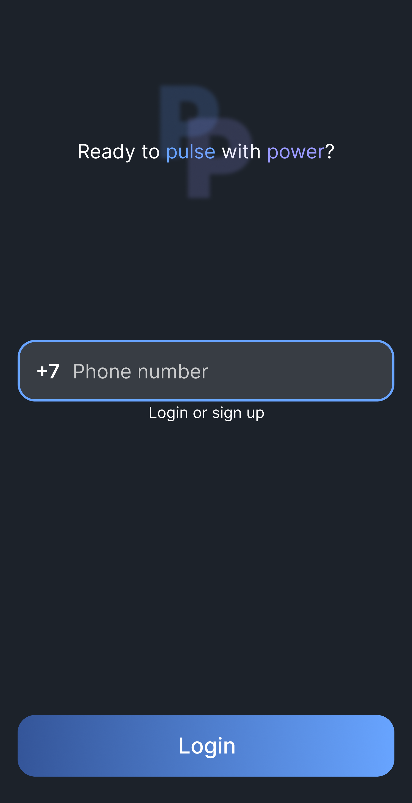
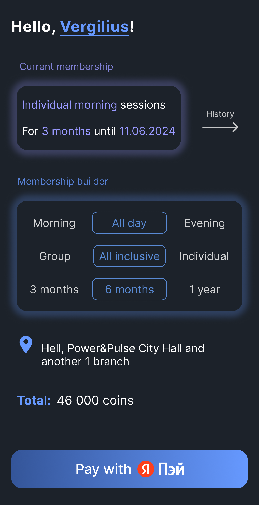
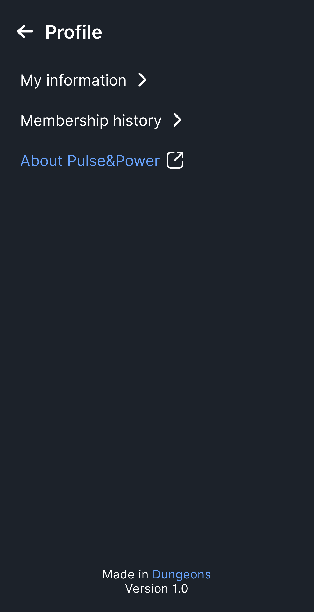

# Pulse&Power

A simplistic and easy to use app for managing one's membership in a gym called «Pulse&Power», done by software duo «Подземелья» ([@zzemlyanaya](https://github.com/zzemlyanaya), [@GlazProject](https://github.com/GlazProject)).
> **❗️** The project is done for learning purpose only; this is NOT a real product and neither is the gym. Any resemblance is purely coincidental. Payment functionality is just an imitation and no real banking API calls are made.

This project has backend part! See [this repo](https://github.com/GlazProject/PulseAndPower).

  
  
  
  

### Features
- Fast login & sing up with only phone number - no password needed
- All important features on the home page immediately after login:
  - Profile access
  - Current membership
  - History access
  - Membership constructor with price calculation
  - Payment button for quick purchase
- Quick purchase repeat from history

### Technologies 
- Written in Kotlin
- Build via Gradle Kotlin DSL
- UI via Jetpack Compose
- Navigation via Jetpack Compose (cr. to Jeo Birch and his [article](https://joebirch.co/android/modular-navigation-with-jetpack-compose/) for the idea)
- DI via Hilt
- Network calls via Retrofit
- Coroutines<3
- Build with combined MVVM/MVI architecture for easy further migration

### Copyright
Copyright 2024 Evgeniya Zemlyanaya.
Licensed under the Apache License, Version 2.0; see [LICENSE.md](LICENSE.md) for full conditions.
